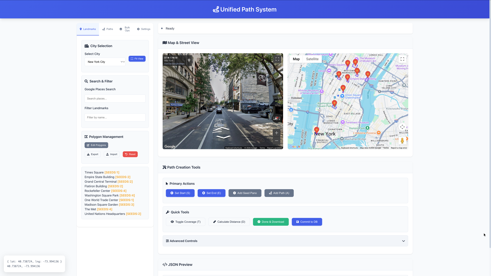
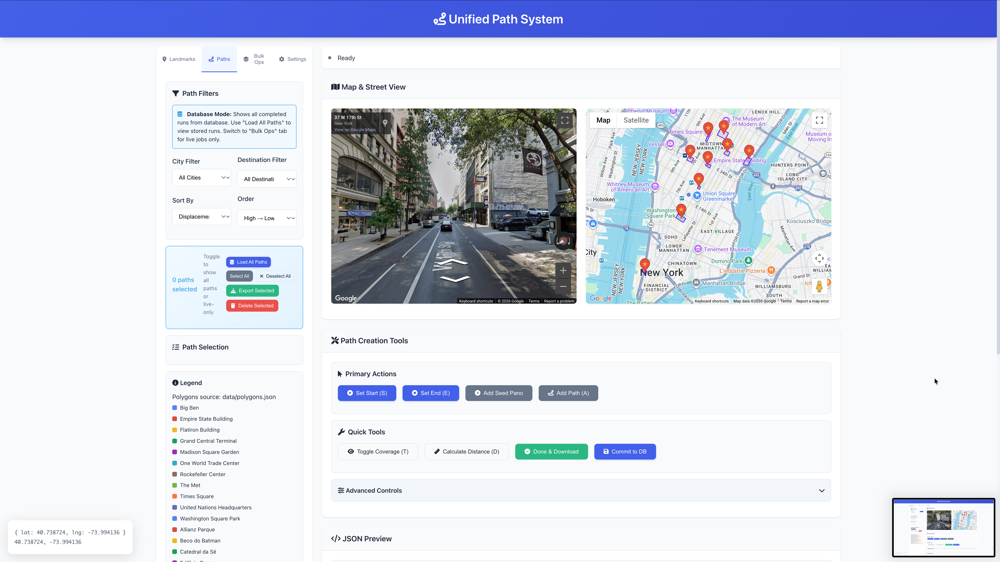
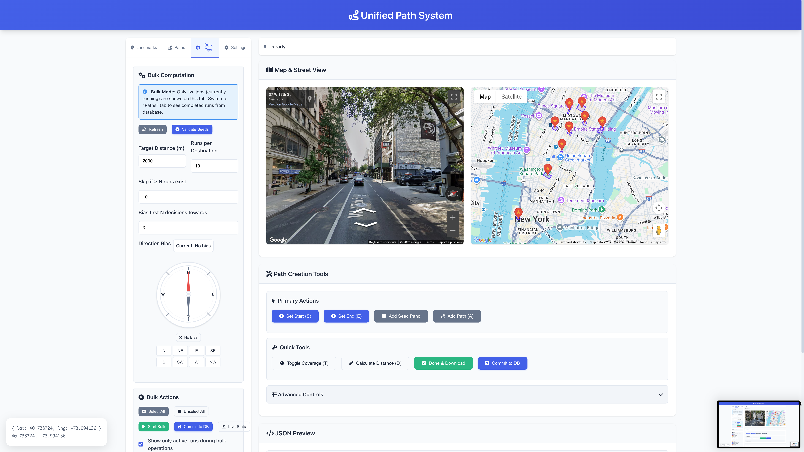

# Street View Pathfinder and Manager

A pathfinding system for navigating through Google Street View environments with intelligent exploration algorithms.

## ✨ Interface Preview

### Main Interface - Landmarks & Navigation



Interactive Street View with Google Maps, landmark markers, and polygon management. Click any landmark to explore with Street View.

### Path Management



View, filter, and export generated paths. Sort by displacement, points, or decisions. Multi-select paths for batch operations.

### Bulk Operations



Run multiple pathfinding jobs with configurable target distance, direction bias, and divergence control.

### Log Viewer - Experiment Visualization


Visualize navigation experiments on satellite maps. Gold markers show API call decision points, blue markers show regular navigation points.


Browse and compare multiple experiment runs. Tracks success/failure status and shows path statistics.

---

## Usage Guide

For a complete walkthrough of how to use the path generator — including adding seed panos, running bulk path generation, monitoring jobs, and exporting paths — see **[USAGE_GUIDE.md](USAGE_GUIDE.md)**.

---

## Quick Start

1. **Install dependencies:**
   ```bash
   pip install -r requirements.txt
   playwright install chromium
   ```

2. **Set your Google Maps API key:**
   ```bash
   export GOOGLE_MAPS_API_KEY="your_api_key_here"
   ```

3. **Start the server:**
   ```bash
   python -m src.server
   ```

4. **Open your browser:**
   Navigate to `http://localhost:8766` (API is on `http://localhost:8765`)

## Project Structure

```
├── src/                    # Python backend
│   ├── server.py           # Main Flask server with pathfinding API
│   ├── environment.py      # Street View environment implementation
│   ├── cache.py            # LMDB caching layer
│   ├── proxy.py            # Panorama proxy server (optional)
│   └── base/               # Base classes
├── web/                    # Frontend
│   ├── index.html          # Main web interface
│   ├── app.js              # Core JavaScript functionality
│   ├── selector.js         # Path selector and bulk operations
│   └── styles.css          # Stylesheet
├── data/                   # Data files
│   ├── landmarks.js        # Landmark coordinates and metadata
│   └── polygons.json       # Polygon boundaries for landmarks
├── docs/screenshots/       # UI screenshots
├── cache/                  # LMDB databases (auto-created, gitignored)
├── requirements.txt        # Python dependencies
└── .env.example            # Environment variable template
```

> **Note:** Log viewers for experiment visualization are located in `../log_viewers/`.

## Features

- **Interactive Street View Navigation**: Click-to-navigate through Street View panoramas
- **Pathfinding Algorithms**: DFS with backtracking, temperature annealing, direction bias
- **Bulk Operations**: Generate multiple paths in parallel with divergence control
- **Path Visualization**: View, compare, and export generated paths
- **Landmark-based Navigation**: Pre-defined landmarks with polygon boundaries
- **LMDB Caching**: Efficient persistent storage for panorama data and paths

## API Endpoints

| Endpoint | Method | Description |
|----------|--------|-------------|
| `/` | GET | Web interface |
| `/api/route/start` | POST | Start a single pathfinding job |
| `/api/route/status` | GET | Get job status |
| `/api/route/stop` | POST | Stop a running job |
| `/api/route/start_batch` | POST | Start multiple pathfinding jobs |
| `/api/route/batch_status` | GET | Get batch job status |
| `/api/paths/runs` | GET | List all stored runs |
| `/api/paths/points` | GET | Get points for a specific run |
| `/api/paths/polygons` | GET | Get polygon metadata |

## API Key Setup

1. Get a Google Maps API key from [Google Cloud Console](https://console.cloud.google.com/)
2. Enable these APIs:
   - Maps JavaScript API
   - Street View Static API
3. Set the environment variable:
   ```bash
   export GOOGLE_MAPS_API_KEY="your_key_here"
   ```
